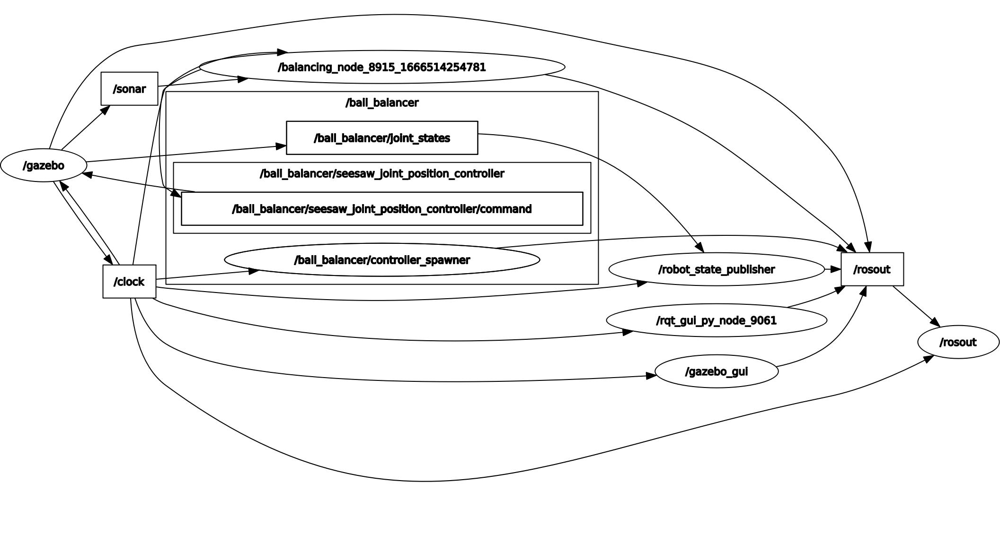

# PID control of Ball and Beam system

## Description
This package uses a ball and beam system to demonstrate PID control. It leverages ROS control's in-built joint_state and joint_position controllers to control the movement of beam. The position of the beam is dictated by a node that subscribes to the `/sonar` topic to receive the current position of the ball using an Ultrasonic distance sensor. It then spits a PID tuned value to the `ball_balancer/seesaw_joint_position_controller/command` topic to move beam to the desired location. These commands are received by the respective controller.  

**RQT Graph**

---
## Code explanation:
1. ball_control.yaml :
- `ball_balancer`: namespace for the controllers.
- `joint_state_controller` & `seesaw_joint_position_controller`: name of the respective controllers.
- `type`: type of controller to be used.
- `joint`: robot joint associated with the controller.
- `pid`: pid parameters.
- `publish_rate`: rate (in Hz) at which data will be published.

2. model.xacro: 
- Ultrasonic sensor plugin
  - `<sensor name="sonar" type="ray">`: a lidar type sensor with name sonar.
  - `<pose>0 0 0 0 0 -1.5707963267948966</pose>`: orientation (xyz rpy) of sensor.
  - `<visualize>true</visualize>`: visualize rays of sensor.
  - `<range>`: define minimum and maximum range of sensor along with the resolution (accuracy). It seems the minimum range supported is 1mm as below that the sensor doesn't work.
  - `<plugin filename="libgazebo_ros_range.so" name="gazebo_ros_range">`: cpp file associated with the sensor. 
  - `<gaussianNoise>0</gaussianNoise>`: used to mimic noise in sensor data as seen in real life situations.

- Joint to actuator transmission: relation between the actuator of robot and joint described in URDF. 
  - `<type>transmission_interface/SimpleTransmission</type>`: type of transmission used.
  - `<joint name="seesaw_joint">`: joint associated with this transmission.
  - `<hardwareInterface>hardware_interface/EffortJointInterface</hardwareInterface>`: hardware interface is used to transmit data from controllers to the hardware. This tag specifies the hardware interface to be used. 
  - `<actuator name="motor1">`: the actuator transmission is connected to.

3. balancing_node.py: subscribes to the `/sonar` topic and evaluates a PID controlled position of the beam needed to balance ball at desired location.   

4. ball_balancer.launch:
- `<param>`: loads the robot and the ball in the parameter server.
- `<node type="spawn_model">`: spawns model of the robot and ball.

5. ball_control.launch: launch file that starts the `controller_manager` and `robot_state_publisher`.
- `<rosparam file="$(find ball_balancer_control)/config/ball_control.yaml" command="load"/>`: loads the controller description to parameter server.
- `<node name="controller_spawner" pkg="controller_manager" type="spawner" respawn="false" output="screen" ns="/ball_balancer" args="joint_state_controller seesaw_joint_position_controller"/>`: starts the `controller_manager` node that accepts the controller descriptions as arguments. 
- `<node name="robot_state_publisher">`: converts joint states to TF transforms.
---

## Miscellaneous:
1. To make sure `balancing_node.py` is installed properly, the following code is added to CMakeLists.txt: 
   catkin_install_python(PROGRAMS
   scripts/balancing_node.py
   DESTINATION ${CATKIN_PACKAGE_BIN_DESTINATION})
2. Execution order: Launching `ball_balancer.launch` -> Launching `ball_control.launch` -> Running `balancing_node.py`  
---

**Ball and Beam Model**
---
